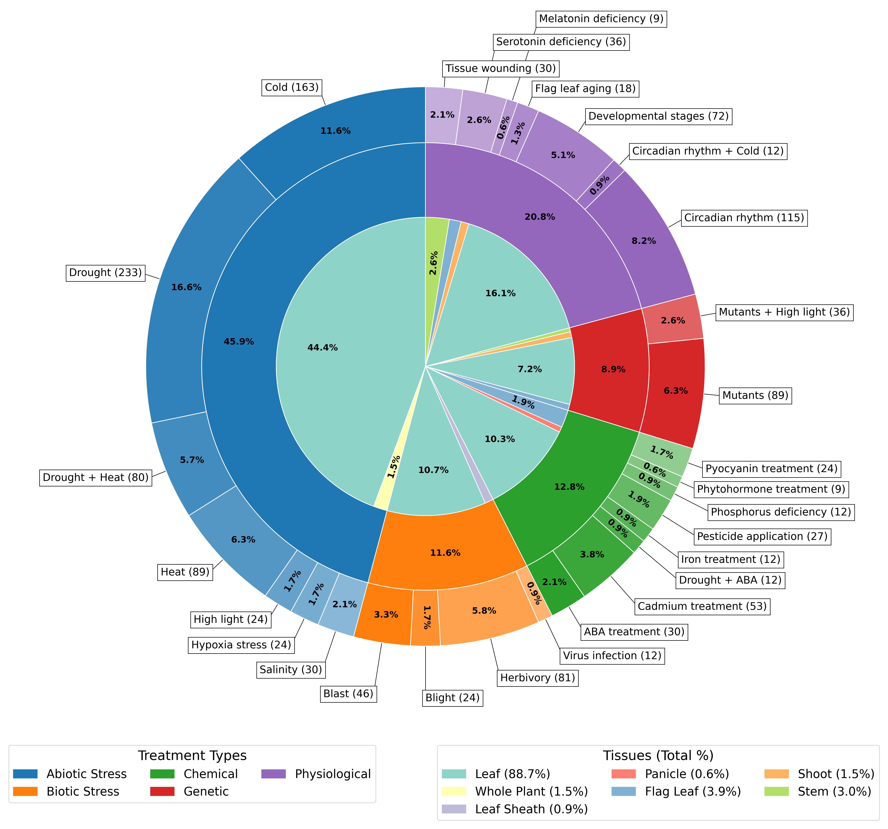
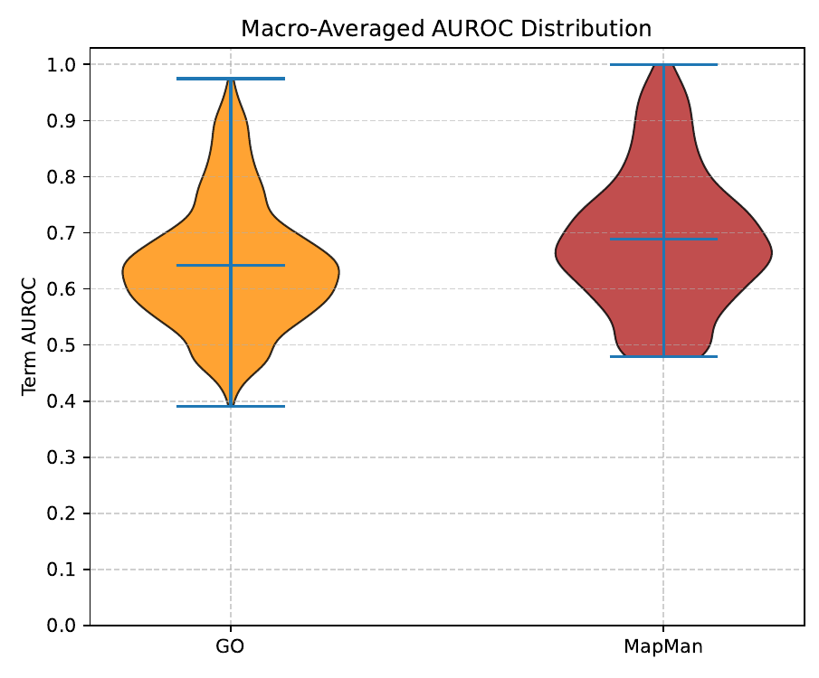
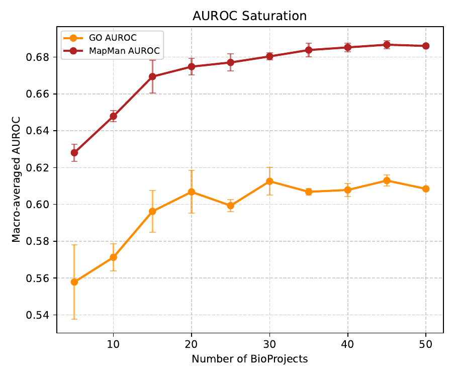
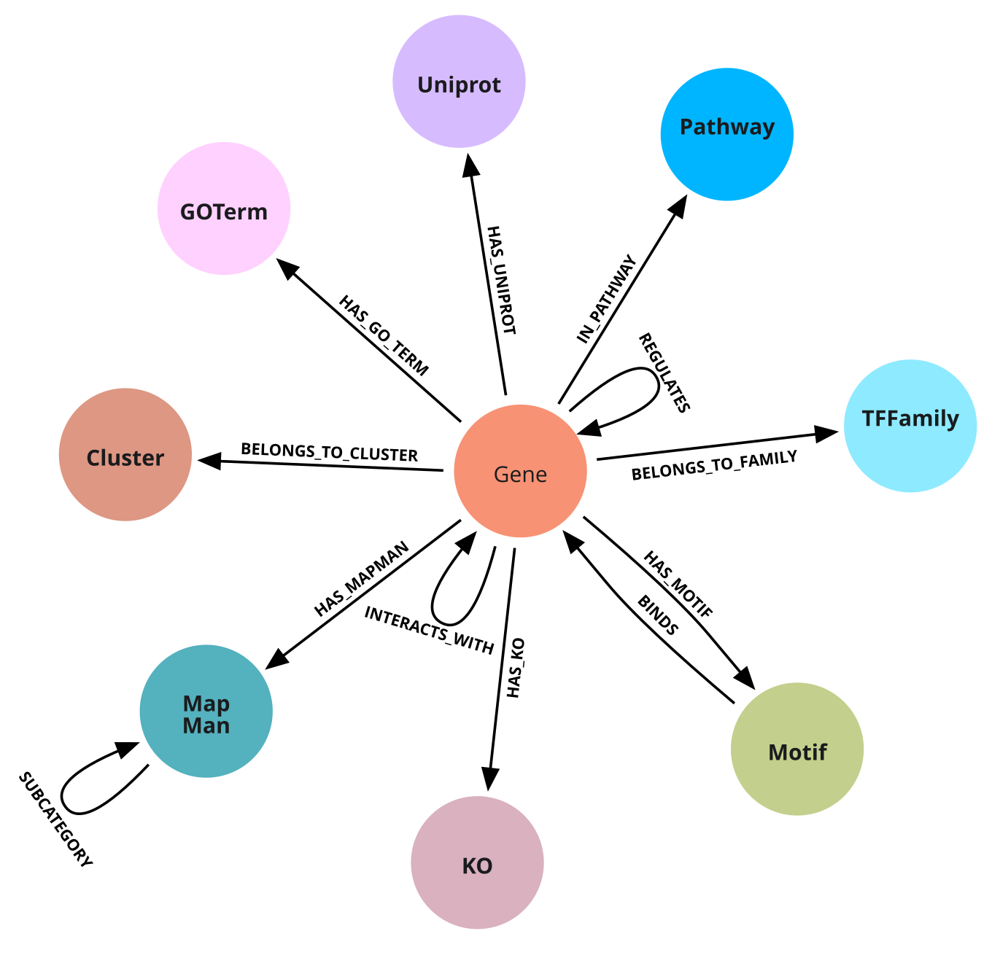

## About Rice2Net

Rice2Net is a webtool for the visualization, exploration, and analysis of the rice (*Oryza sativa*) gene regulatory network (GRN) and coexpression data. The tool interfaces with a Neo4j graph database to render topological data into a force-directed graph. Users filter subnetworks, manipulate node visibility, adjust layout parameters, and cross-reference genes with functional annotations.

## Usage

Rice2Net provides a canvas paired with a control panel. By default, the application loads a topological overview of the database. Users navigate the canvas using Pan and Select modes located in the toolbar, and interact with nodes to view metadata. The functionalities are divided into the following sections:

<b>Target Explorer</b>

The **Target Explorer** allows users to isolate subnetworks based on a list of genes.

* **Target Input:** Users input locus identifiers (RAP or MSU format) manually or via a `.txt` file upload.
* **Search Depth:** Determines how many topological steps (edges) away from the target genes the network traverses to pull in neighboring nodes.
* **Prune Dead Ends:** A toggle that removes "leaf" nodes (nodes with a degree of 1) from the filtered subnetwork, retaining the interconnected graph.
* **Connect Neighbors:** This toggle dictates graph traversal logic during subnetwork filtering. When enabled, the filter identifies and draws edges between nodes in the target subset and their retrieved neighbors. When disabled, the filter draws edges radiating from the initial target nodes, resulting in a radial topology. This logic applies to graph manipulation: when enabled during node expansion, the system draws edges between introduced nodes and existing nodes on the canvas. When disabled, introduced nodes connect exclusively to the expanded parent node.
* **Graph Manipulation:** While in "Select" mode, right-clicking a node reveals manipulation options:
  * **Expand:** Fetches and renders database neighbors of a leaf node.
  * **Contract:** Removes leaf nodes attached to the selected node.
  * **Pop:** Deletes the selected node from the visualization.

<b>Layout</b>

The **Layout** panel provides control over the rendering and the D3.js force simulation engine.

* **Visual Settings:** Controls for toggling Light/Dark themes, base node size, degree-based node scaling (sizes nodes based on edge count), edge width, and edge opacity.
* **Physics Settings:** Modifiers for the graph algorithm. Users adjust Link Length (spring distance), Repulsion (charge force between nodes), Collision Radius (prevents node overlap), and Compression (radial force pulling nodes toward the canvas center).
* **Recalculate Layout:** Reignites the physics simulation to untangle topological structures after filtering or manipulation.

<b>Export</b>

The **Export** suite allows users to extract visualizations and tabular data.

* **Locus ID Format:** A toggle that defines whether exported data files prioritize RAP-DB or MSU formatting for gene identifiers.
* **Export Image (.png):** Generates a snapshot of the canvas. A "Show all edges" toggle forces the renderer to paint edges connected to transparent (hidden) nodes.
* **Export Edges (.tsv):** Downloads visible topological links, including source/target mapping, edge weights, IRP scores, and directionality flags.
* **Export Layout (.json):** Saves spatial coordinates (`x`, `y`), visibility states, and metadata of the canvas, allowing the user to import and restore the visualization.
* **Export Genes (.tsv):** Downloads a tabular list of visible genes along with flattened metadata columns (Symbol, Transcription Factor families, mapped pathways).

<b>Import</b>

The **Import** section allows users to load networks or restore saved application states, overriding the Neo4j database connection.

* **Load Layout JSON:** Restores a network exported via the "Export Layout (.json)" function. This restores spatial positioning without recalculating the physics engine.
* **Load Edges TSV:** Accepts a `.tsv`, `.csv`, or `.txt` file containing Source and Target columns (with Weights). The application builds the topology, queries the database for metadata, and calculates a physics layout.
* **Revert to Database:** An active import displays its filename in the panel alongside an "✕" button. Clicking this button clears the imported data and restores the network from the database.

## Data

<b>Annotation Sources</b>

Rice2Net aggregates annotations and sequence identifiers from databases to provide context for each node. The following annotation sources are integrated into the database:

* **Gene Identifiers:** Primary cross-referencing utilizes **RAP-DB** (Rice Annotation Project) and **MSU** (Michigan State University) locus IDs, alongside gene symbols and GenBank identifiers.
* **Gene Ontology (GO):** Functional classification terms (Biological Process, Molecular Function, Cellular Component) mapped to EBI QuickGO URLs.
* **MapMan:** Ontology bin codes detailing metabolic pathways and cellular processes.
* **KEGG:** (Kyoto Encyclopedia of Genes and Genomes) Mapped pathway codes and network descriptions.
* **UniProt:** Cross-referenced protein database entries containing reviewed status, protein names, and alias mapping.
* **Transcription Factor (TF) Databases:** TF families are assigned using **PlantTFDB** (for TFs) and **iTAK v1.8** (for Predicted TFs and Predicted TRs).

<b>Coexpression</b>

The dataset comprises 1402 samples from photosynthetic tissues. Treatments include abiotic stress, physiological conditions, chemical applications, biotic stress, and genetic modifications. Genetic modifications involve mutations influencing chloroplast development.

  

The reference transcriptome and proteome for Oryza sativa subsp. japonica (genome assembly IRGSP-1.0) were used. Data was sourced from the following NCBI SRA BioProjects: PRJNA1219119, PRJNA609211, PRJNA1255502, PRJNA575016, PRJNA1073311, PRJNA753062, PRJNA890021, PRJNA917024, PRJNA1020267, PRJNA1293730, PRJNA933387, PRJNA350792, PRJNA1174730, PRJNA1198503, PRJNA1068025, PRJNA358135, PRJNA716196, PRJNA532802, PRJNA603205, PRJNA1120955, PRJNA1229755, PRJNA1148223, PRJNA1067293, PRJNA1234113, PRJNA1234517, PRJNA730675, PRJEB64872, PRJNA1036792, PRJNA1121593, PRJNA751936, PRJNA1011474, PRJNA802358, PRJNA894465, PRJNA1019094, PRJNA741871, PRJNA430015, PRJNA601442, PRJNA450806, PRJNA811347, PRJNA1141930, PRJNA1260801, PRJNA1067651, PRJNA790476, PRJNA767196, PRJNA386172, PRJNA609653, PRJNA631179, PRJNA1010774, PRJNA408068, and PRJNA560146.

RNA-seq data processing was executed using a standard pipeline. Read trimming and quality filtering were performed applying a sliding window size of 4 and a mean quality threshold of 20. Transcript quantification was carried out with 100 bootstrap samples, and quality control metrics were aggregated. BioProjects exhibiting a mean sample alignment rate below 60% were excluded. Transcript abundances were aggregated into gene counts, and data was normalized to generate Variance Stabilizing Transformation (VST) matrices. Prior to network inference, genes were filtered to retain those maintaining a minimum count of 10 in at least 10% of the dataset, with a cross-dataset variance of ≥ 0.5.

The expression matrix was subjected to GRN reconstruction using the Seidr toolkit. An ensemble of six inference algorithms was applied: Pearson correlation, Spearman rank correlation, Partial correlation (PCOR), Random Forests (GENIE3), Context Likelihood of Relatedness (CLR), and Algorithm for the Reconstruction of Accurate Cellular Networks (ARACNE). Seidr's Inverse Rank Product (IRP) method was used to aggregate the networks generated by each algorithm into a consensus network. This consensus network was pruned using Seidr's backbone function with a Z-score threshold of 1.28 to extract the network topology.

<b>Network Performance</b>

The global network was evaluated against functional annotations. The distribution of macro-averaged AUROC metrics yielded a mean of 0.6429 across 1,786 Gene Ontology (GO) terms and a mean of 0.6866 across 780 MapMan bins. Network saturation analysis evaluated the macro-averaged AUROC across dataset subsets of varying BioProject counts. The macro-averaged AUROC reached a performance plateau at 20 BioProjects for GO and MapMan annotations.

  
  

<b>TF-Promoter Binding</b>

Motif references used in TF-Promoter Binding are sourced from **PlantTFDB**, **JASPAR Core**, **JASPAR Unvalidated**, and **CIS-BP**. Rice and homologous TF binding motifs from PlantTFDB, JASPAR, and CIS-BP were obtained. Motifs were associated with loci non-exclusively. Gene promoters (2000 bp upstream of start codon) were extracted using **bedtools**. Promoters were scanned for cis-binding sites using **FIMO** (MEME Suite). This identified regulator-regulated gene pairs within GRNs.

<b>Functional Clusters</b>

Community detection within networks was performed using Python **Infomap**. Modules were functionally annotated using **g:GOSt** (**g:Profiler**).

## Architecture

Rice2Net operates as a client-side application supported by a Node.js Express middleware server connecting to a Neo4j graph database. The application logic is segmented into domain-specific modules.

<b>Client Modules</b>

* **`globals.js`:** Initializes global states, visual configuration parameters, color palettes, and random number generation functions.
* **`data.js`:** Executes database initialization routines, builds graph adjacency structures, loads functional clusters, and manages node metadata hydration.
* **`core.js`:** Processes local file imports (JSON/TSV), applies force simulation algorithms, and executes the core canvas rendering loop.
* **`filter.js`:** Resolves gene identifiers, calculates subnetwork traversal based on user targets, and executes targeted graph manipulation actions (expand, pop, contract).
* **`sim.js`:** Contains fallback layout calculation logic, defines physical parameters, and dictates geometric drawing rules for directional edges.
* **`graph.js`:** Implements canvas zoom and pan interactions, calculates view centering, and recalculates visual states during filtering.
* **`legends.js`:** Generates HTML legend elements and updates data visibility toggles for nodes, clusters, and edges.
* **`ui.js`:** Iterates through visible entities to compute and update statistical counters.
* **`kegg.js`:** Formats external database queries and renders pathway map iframes.
* **`controls.js`:** Manages user input parameters, threshold sliders, and visual theme toggles.
* **`exporters.js`:** Iterates current graph states to compile exportable image and tabular files.
* **`interactions.js`:** Processes mouse events, manages coordinate mapping, displays tooltips, and triggers context menus.

<b>Server Communication</b>

The application retrieves graph data using asynchronous HTTP requests directed at middleware endpoints.

* **Network Initialization:** Upon application load, the client calls `/api/network/init`. This endpoint queries Neo4j to return node identifiers, base spatial coordinates, and unweighted coexpression edges.
* **Cluster Loading:** During initialization, the client fetches predefined node groups using the `/api/network/clusters` endpoint.
* **Metadata Hydration:** When a user selects a node, the application queries `/api/network/node/:id`. The server executes optional pattern matching to return associated Gene Ontology terms, MapMan bins, KEGG pathways, UniProt cross-references, and Transcription Factor classifications.
* **Regulation Matching:** Activating regulation visibility prompts the application to batch active node pairs and submit them to `/api/network/edges/regulates`. The endpoint identifies directional relationships and returns the results to append to the active graph.
* **TF-Promoter Binding:** Inspecting a regulatory edge triggers a query to `/api/network/edges/binds` utilizing the source and target node identifiers. The server retrieves motif sequences, strand coordinates, p-values, and q-values.

<b>Database Architecture</b>

The data is stored in a Neo4j graph database. As illustrated in `db_structure.png`, the schema relies on a central `Gene` node. Peripheral nodes store annotation metadata and connect to the core `Gene` nodes via specific directional relationships. Regulatory and coexpression networks are formed by self-referential relationships between `Gene` nodes.

  

**Node Statistics**

| Node Label | Record Count |
| --- | --- |
| `Uniprot` | 102,601 |
| `Gene` | 46,036 |
| `MapMan` | 8,751 |
| `GOTerm` | 4,588 |
| `Motif` | 501 |
| `Pathway` | 160 |
| `TFFamily` | 99 |
| `Cluster` | 12 |

**Topology and Edge Statistics**

| Source Node | Relationship | Target Node | Edge Count |
| --- | --- | --- | --- |
| `Motif` | `BINDS` | `Gene` | 11,583,032 |
| `Gene` | `REGULATES` | `Gene` | 10,658,049 |
| `Gene` | `INTERACTS_WITH` | `Gene` | 885,521 |
| `Gene` | `HAS_GO_TERM` | `GOTerm` | 57,794 |
| `Gene` | `HAS_UNIPROT` | `Uniprot` | 49,005 |
| `Gene` | `HAS_MAPMAN` | `MapMan` | 16,237 |
| `Gene` | `IN_PATHWAY` | `Pathway` | 11,261 |
| `Gene` | `BELONGS_TO_CLUSTER` | `Cluster` | 11,259 |
| `MapMan` | `SUBCATEGORY_OF` | `MapMan` | 8,719 |
| `Gene` | `BELONGS_TO_FAMILY` | `TFFamily` | 2,425 |
| `Gene` | `HAS_MOTIF` | `Motif` | 984 |

## Team

* **Manuel Almeida** (Lead Developer): manuel.p.almeida13@gmail.com
* **Henrique Niza** (Backend & Security Developer): henrique.niza@itqb.unl.pt
* **Tomás Gil** (Rice2Net Logo Design): tmslongle@gmail.com
* **Pedro Barros, Ph.D.** (Thesis Supervisor): pbarros@itqb.unl.pt
* **Tiago Lourenço, Ph.D.** (Thesis Co-Supervisor): tsantos@itqb.unl.pt
* **M. Margarida Oliveira, Ph.D.** (Lab Director): mmolive@itqb.unl.pt

## Acknowledgements & Funding

### Acknowledgements
We acknowledge the GPlantS lab at ITQB for their support throughout this project, and the Master in Computational Biology and Bioinformatics program from NOVA FCT.

### Funding
This work was supported by FCT - Fundação para a Ciência e a Tecnologia, I.P., through:
* Rice2B project (2022.02916.PTDC, DOI: 10.54499/2022.02916.PTDC)
* Green-it Bioresources for Sustainability R&D Unit (UID/04551/2025, DOI: 10.54499/UID/04551/2025; UID/PRR/04551/2025, DOI: 10.54499/UID/PRR/04551/2025)
* LS4FUTURE Associated Laboratory (LA/P/0087/2020, DOI: 10.54499/LA/P/0087/2020)

